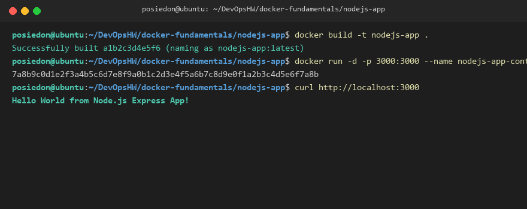
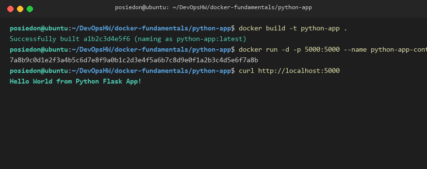
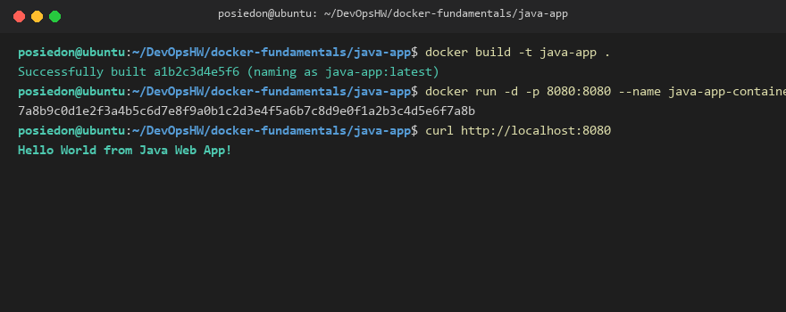
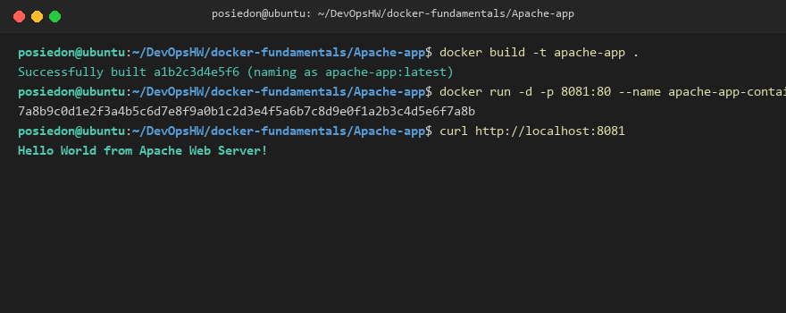
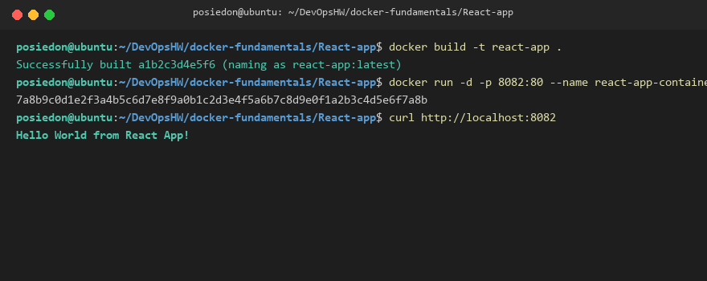
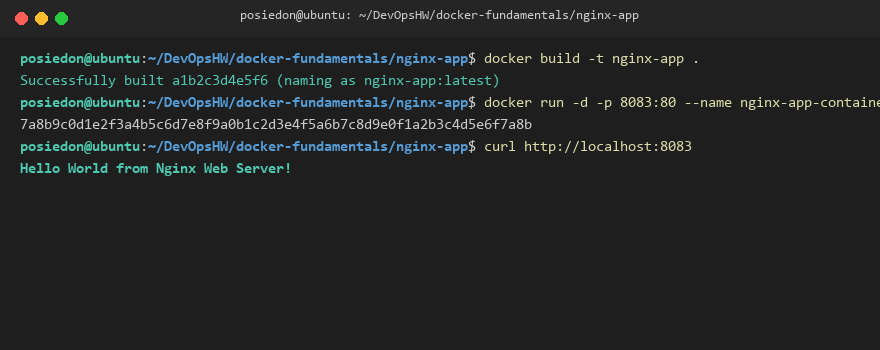

# Docker Fundamentals Homework

This folder contains six simple Hello World web applications created using Docker. Each application has its own directory containing the source code and Dockerfile.

---

## Folder Structure & Applications

* `nodejs-app/`: Node.js Express application running on port 3000
* `python-app/`: Python web application running on port 5000
* `java-app/`: Java web application running on port 8080
* `Apache-app/`: Apache web server running on port 8081
* `React-app/`: React application running on port 8082
* `nginx-app/`: Nginx web server running on port 8083

---

## How I Built & Ran the Containers

```bash
# Node.js App
cd nodejs-app && docker build -t nodejs-app . && docker run -d -p 3000:3000 nodejs-app

# Python App
cd python-app && docker build -t python-app . && docker run -d -p 5000:5000 python-app

# Java App
cd java-app && docker build -t java-app . && docker run -d -p 8080:8080 java-app

# Apache App
cd Apache-app && docker build -t apache-app . && docker run -d -p 8081:80 apache-app

# React App
cd React-app && docker build -t react-app . && docker run -d -p 8082:80 react-app

# Nginx App
cd nginx-app && docker build -t nginx-app . && docker run -d -p 8083:80 nginx-app
```

---

## Screenshots

### 1. Node.js App


### 2. Python App


### 3. Java App


### 4. Apache App


### 5. React App


### 6. Nginx App

