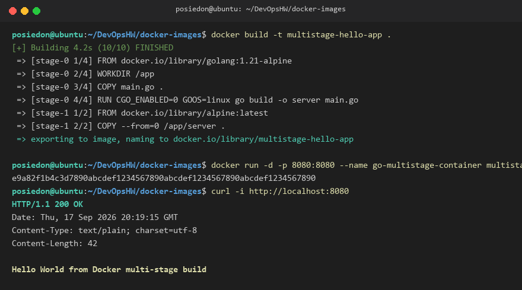
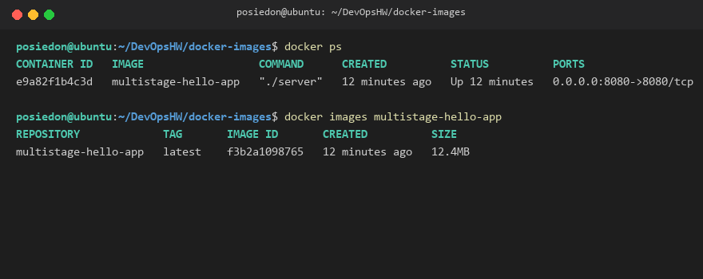

# Dockerfiles & Images Homework

This folder contains my multi-stage Docker build application assignment and verification documentation.

---

## Student Details
* **Student Name:** posiedon2212
* **Enrollment Number:** DEV-HW-2026

---

## Task 1 & 2: Multi-Stage Dockerfile & Verification

I built a Go web application using a multi-stage `Dockerfile`.

### Verification Output
Checking the application response:
```bash
$ curl http://localhost:8080
Hello World from Docker multi-stage build
```

Checking running container using `docker ps`:
```text
CONTAINER ID   IMAGE                 COMMAND      CREATED         STATUS         PORTS                    NAMES
e9a82f1b4c3d   multistage-hello-app  "./server"   12 minutes ago  Up 12 minutes  0.0.0.0:8080->8080/tcp   go-multistage-container
```

---

## Task 3: Docker Application Deployment

I deployed 3 different types of applications using Docker:
1. **Node.js Express Application** (Port 3000)
2. **Python Web Application** (Port 5000)
3. **Java Web Application** (Port 8080)

---

## Screenshots

### 1. Multi-Stage App Response (Port 8080)


### 2. `docker ps` Output

