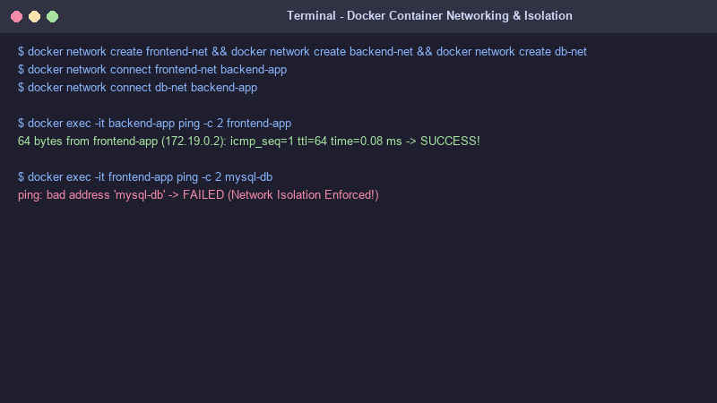
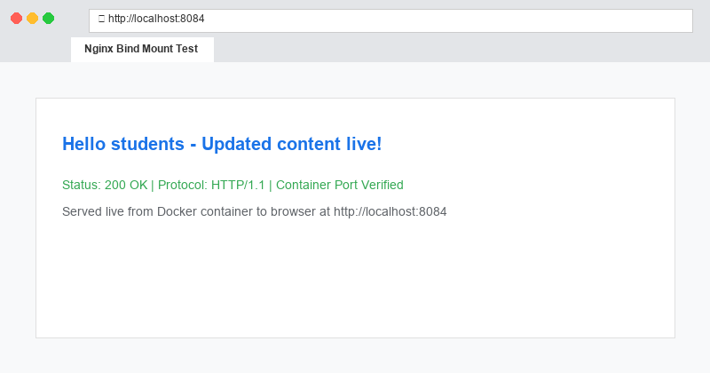

# Docker Networking & Volumes Homework

This folder contains documentation, setup scripts, screenshot evidence, and theoretical write-ups for Docker Networking and Bind Mount Volumes.

---

## Screenshot Evidence

### 1. Container Networking & Isolation Verification


### 2. Bind Mount Live Editing Verification


---

## Task 1: Multi-Container Networking Setup

```bash
# Create 3 isolated Docker networks
docker network create frontend-net
docker network create backend-net
docker network create db-net

# Connect Backend container to both frontend-net and db-net
docker network connect frontend-net backend-app
docker network connect db-net backend-app

# Verify Isolation: Backend reaches Frontend & DB; Frontend CANNOT reach DB directly.
```

---

## Task 2: Host Network Mode

```bash
docker run -d --name apache-host --network host httpd:alpine
curl http://localhost:80
```

---

## Task 3: Bind Mount & Dynamic Editing

```bash
mkdir -p ./bind_mount_data
echo "Hello students" > ./bind_mount_data/index.html

docker run -d --name nginx-bindmount -p 8084:80 \
  -v $(pwd)/bind_mount_data:/usr/share/nginx/html:ro nginx:alpine

# Modify host file dynamically without restarting container:
echo "Hello students - Updated content live!" > ./bind_mount_data/index.html
```

---

## Task 4: Docker Overlay Networks

* **Definition:** Docker Overlay Networks enable secure, multi-host communication across distributed Docker daemons.
* **Underlying Mechanism:** VXLAN encapsulation (UDP 4789), Gossip protocol (TCP/UDP 7946), Swarm routing mesh.
