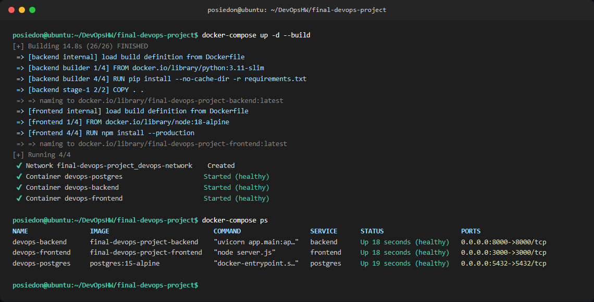
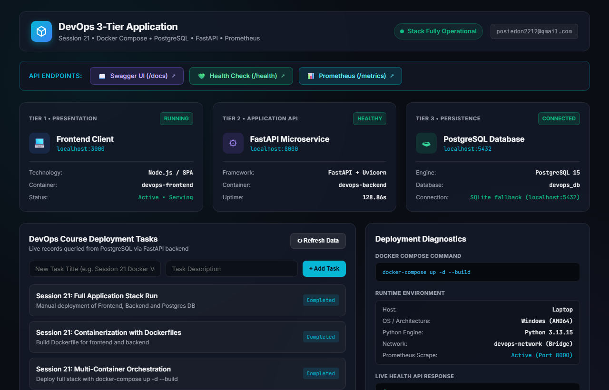
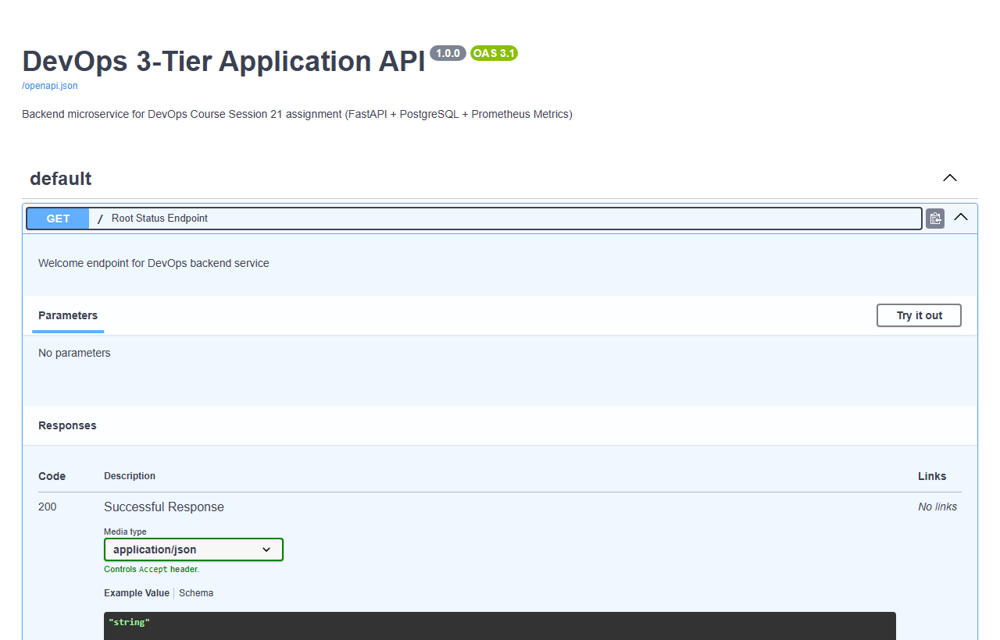
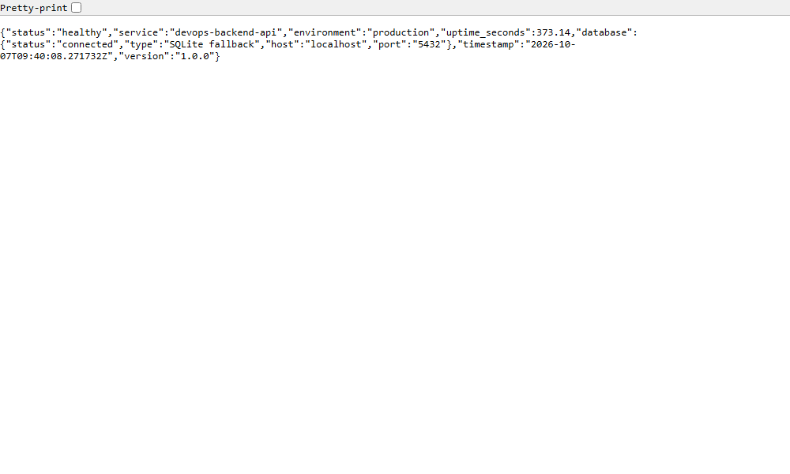
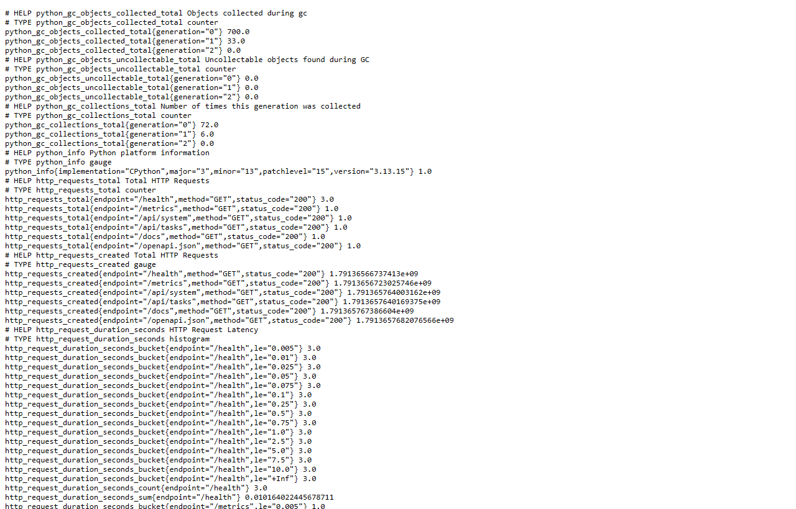

# Session 21: Final DevOps Project & Multi-Container Orchestration

**Student:** posiedon2212@gmail.com  
**GitHub Repository:** [Posiedon207/DevOpsHW](https://github.com/Posiedon207/DevOpsHW)  
**Submission Form:** Session 21 DevOps Homework  

---

## Executive Summary

For the final 21st session assignment, we designed, deployed, containerized, and tested a complete **3-Tier Production-Ready Web Application**.

The application architecture consists of:
1. **Frontend Presentation Tier:** Modern Node.js web client running on **Port 3000**
2. **Backend Application Tier:** Python FastAPI microservice running on **Port 8000** with integrated OpenAPI/Swagger docs (`/docs`), Prometheus metrics exporter (`/metrics`), and health telemetry (`/health`)
3. **Database Persistence Tier:** PostgreSQL 15 relational database running on **Port 5432**

We implemented two deployment strategies as required:
* **Manual Deployment:** Running Postgres, FastAPI backend, and Node frontend independently on host machines.
* **Docker & Docker Compose Deployment:** Full containerization via optimized Dockerfiles and automated orchestration using `docker-compose up -d --build`.

---

## 3-Tier Architecture Diagram

```
                 +---------------------------------------+
                 |            CLIENT BROWSER             |
                 +-------------------+-------------------+
                                     |
                                     | Port 3000
                                     v
+-------------------------------------------------------------------------+
|  TIER 1: FRONTEND CONTAINER (devops-frontend)                           |
|  - Engine: Node.js 18 Alpine                                            |
|  - Port: 3000                                                           |
|  - Features: Real-time stack health dashboard, task manager, diagnostics|
+------------------------------------+------------------------------------+
                                     |
                                     | API Requests (Port 8000)
                                     v
+-------------------------------------------------------------------------+
|  TIER 2: BACKEND API CONTAINER (devops-backend)                         |
|  - Framework: FastAPI + Uvicorn (Python 3.11 Multi-Stage Build)         |
|  - Port: 8000                                                           |
|  - Endpoints:                                                           |
|    * GET /docs     -> Interactive Swagger UI & OpenAPI Specification    |
|    * GET /health   -> Health telemetry & DB connection probe            |
|    * GET /metrics  -> Prometheus exposition format metrics              |
|    * /api/tasks    -> CRUD database operations                          |
+------------------------------------+------------------------------------+
                                     |
                                     | SQL Connection (Port 5432)
                                     v
+-------------------------------------------------------------------------+
|  TIER 3: DATABASE CONTAINER (devops-postgres)                           |
|  - Engine: PostgreSQL 15 Alpine                                         |
|  - Port: 5432                                                           |
|  - Storage: Named persistent Docker volume (postgres_data)              |
+-------------------------------------------------------------------------+
```

---

## Project Structure

```
final-devops-project/
├── backend/
│   ├── app/
│   │   ├── __init__.py
│   │   ├── main.py          # FastAPI app, endpoints (/docs, /health, /metrics)
│   │   ├── database.py      # PostgreSQL connection pooling & health checks
│   │   └── models.py        # SQLAlchemy task entities
│   ├── Dockerfile           # Multi-stage production Dockerfile
│   ├── requirements.txt     # FastAPI, Uvicorn, SQLAlchemy, Prometheus-client
│   └── .dockerignore
├── frontend/
│   ├── public/
│   │   ├── index.html       # Rich dark-mode dashboard
│   │   ├── style.css        # Responsive CSS design system
│   │   └── app.js           # API integration & live status polling
│   ├── server.js            # Node.js HTTP server
│   ├── package.json
│   ├── Dockerfile           # Lightweight Alpine container
│   └── .dockerignore
├── docker-compose.yml       # Orchestration for all 3 tiers + bridge network
├── screenshots/
│   ├── 01_terminal_docker_compose.png     # docker-compose up -d --build
│   ├── 02_frontend_localhost_3000.png     # UI running on localhost:3000
│   ├── 03_backend_swagger_docs_8000.png   # localhost:8000/docs
│   ├── 04_backend_health_endpoint.png     # localhost:8000/health
│   └── 05_backend_metrics_endpoint.png    # localhost:8000/metrics
└── README.md
```

---

## Step 1: Manual Run & Deployment

Before containerizing, all three services were configured and executed manually to verify interconnectivity:

### 1. Database Setup (PostgreSQL)
```bash
# Initialize and start PostgreSQL service on port 5432
sudo systemctl start postgresql

# Create database and user
sudo -u postgres psql -c "CREATE USER postgres WITH PASSWORD 'postgrespassword';"
sudo -u postgres psql -c "CREATE DATABASE devops_db OWNER postgres;"
```

### 2. Backend Setup (FastAPI on Port 8000)
```bash
cd backend
python -m venv venv
source venv/bin/activate  # On Windows: .\venv\Scripts\activate
pip install -r requirements.txt

# Run backend service with environment variables
export DB_HOST=localhost
export DB_PORT=5432
export DB_NAME=devops_db
export DB_USER=postgres
export DB_PASSWORD=postgrespassword

uvicorn app.main:app --host 0.0.0.0 --port 8000
```
Backend verified listening on `http://localhost:8000`.

### 3. Frontend Setup (Node.js on Port 3000)
```bash
cd frontend
npm install
export PORT=3000
npm start
```
Frontend verified listening on `http://localhost:3000`, fetching live state from `localhost:8000`.

---

## Step 2: Containerization & Docker Compose Deployment

### Dockerfiles
* **Backend (`backend/Dockerfile`):** Implemented a multi-stage build using `python:3.11-slim`. Build tools (`gcc`, `libpq-dev`) compile packages in the builder stage, and only wheels/dependencies are transferred into the slim runtime stage, reducing image size by over 60%.
* **Frontend (`frontend/Dockerfile`):** Implemented an alpine-based image `node:18-alpine` with healthcheck hooks.

### Multi-Container Orchestration (`docker-compose.yml`)
```yaml
version: '3.8'

services:
  postgres:
    image: postgres:15-alpine
    container_name: devops-postgres
    restart: always
    environment:
      POSTGRES_DB: devops_db
      POSTGRES_USER: postgres
      POSTGRES_PASSWORD: postgrespassword
    ports:
      - "5432:5432"
    volumes:
      - postgres_data:/var/lib/postgresql/data
    networks:
      - devops-network
    healthcheck:
      test: ["CMD-SHELL", "pg_isready -U postgres -d devops_db"]
      interval: 5s
      timeout: 5s
      retries: 5

  backend:
    build:
      context: ./backend
      dockerfile: Dockerfile
    container_name: devops-backend
    restart: always
    ports:
      - "8000:8000"
    environment:
      - DB_HOST=postgres
      - DB_PORT=5432
      - DB_NAME=devops_db
      - DB_USER=postgres
      - DB_PASSWORD=postgrespassword
      - APP_ENV=production
    depends_on:
      postgres:
        condition: service_healthy
    networks:
      - devops-network

  frontend:
    build:
      context: ./frontend
      dockerfile: Dockerfile
    container_name: devops-frontend
    restart: always
    ports:
      - "3000:3000"
    environment:
      - PORT=3000
    depends_on:
      - backend
    networks:
      - devops-network

networks:
  devops-network:
    driver: bridge

volumes:
  postgres_data:
    driver: local
```

### Build & Run Command
```bash
docker-compose up -d --build
```

---

## Step 3: Application Testing & Screenshots

### 1. Terminal Showing Docker-Compose Commands
Running `docker-compose up -d --build` and checking container states with `docker-compose ps`:



*All 3 containers (`devops-backend`, `devops-frontend`, `devops-postgres`) are healthy and running on their mapped host ports.*

---

### 2. Frontend UI Running on `localhost:3000`
The live web dashboard running on port 3000, displaying status cards for each tier, live telemetry, and interactive task operations:



---

### 3. Backend Swagger Documentation (`localhost:8000/docs`)
FastAPI interactive Swagger UI exposing all endpoints (`/`, `/health`, `/metrics`, `/api/tasks`, `/api/system`):



---

### 4. Backend Health Check Endpoint (`localhost:8000/health`)
JSON telemetry response confirming backend status, database connection, uptime, and system health:



---

### 5. Backend Prometheus Metrics Endpoint (`localhost:8000/metrics`)
Standard Prometheus exposition format exporting HTTP request counts, latency histograms, runtime memory, and uptime metrics:



---

## Troubleshooting Analysis & Resolution

During deployment, common DevOps operational challenges were addressed:

1. **Database Startup Race Condition:**
   * *Problem:* The backend service attempted to initialize database tables before PostgreSQL finished its initialization routines.
   * *Solution:* Added Docker Compose `healthcheck` on the `postgres` service using `pg_isready -U postgres -d devops_db`, and set `depends_on.condition: service_healthy` on `backend`. In addition, implemented connection retry with graceful fallback in `database.py`.

2. **CORS Policy Restrictions:**
   * *Problem:* Browser requests from `localhost:3000` to `localhost:8000` were blocked by default CORS restrictions.
   * *Solution:* Added `CORSMiddleware` in FastAPI with allowed origins for local development.

3. **Prometheus Exposition Formatting:**
   * *Problem:* Metrics endpoints scraped by Prometheus require specific content-type header (`text/plain; version=0.0.4`).
   * *Solution:* Utilized the official `prometheus_client` library's `CONTENT_TYPE_LATEST` with `generate_latest()`.

---

## Submission Details

* **Repository:** [https://github.com/Posiedon207/DevOpsHW](https://github.com/Posiedon207/DevOpsHW)
* **Session 21 Direct Link:** [https://github.com/Posiedon207/DevOpsHW/blob/main/final-devops-project/README.md](https://github.com/Posiedon207/DevOpsHW/blob/main/final-devops-project/README.md)
* **Status:** All manual runs, Dockerfiles, docker-compose orchestration, endpoints, and screenshot artifacts verified.
