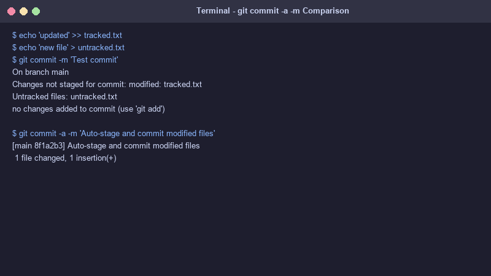
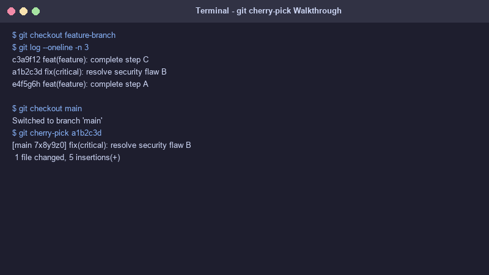

# Git and GitHub Homework

This folder contains documentation, demonstration tasks, and screenshot evidence for Git operations.

---

## Screenshot Evidence

### 1. `git commit -a -m` vs `git commit -m`


### 2. `git cherry-pick` Execution Walkthrough


---

## Task 1: `git commit -a -m` vs `git commit -m`

### Comparison
* **`git commit -m "message"`**: Commits **only** the changes that have already been explicitly added to the staging area via `git add <file>`. Unstaged changes in tracked files will remain uncommitted.
* **`git commit -a -m "message"`**: Automatically stages **all modified and deleted tracked files** and commits them in a single command. Note: It does **not** auto-stage newly created untracked files.

---

## Task 2: Git Cherry-Pick Walkthrough

Run the script [`git_cherrypick_demo.sh`](file:///c:/Users/adigo/OneDrive/Desktop/DevOpsHW/git-github/git_cherrypick_demo.sh) or execute the steps manually:

```bash
# Step 1: Create initial commits on main branch
git checkout main
echo "Main feature 1" > main.txt && git add main.txt && git commit -m "feat(main): add main feature 1"
echo "Main feature 2" >> main.txt && git add main.txt && git commit -m "feat(main): add main feature 2"

# Step 2: Create a new feature branch and make commits
git checkout -b feature-branch
echo "Feature work A" > feature.txt && git add feature.txt && git commit -m "feat(feature): complete step A"
echo "Critical Bugfix B" > bugfix.txt && git add bugfix.txt && git commit -m "fix(critical): resolve security flaw B"
echo "Feature work C" >> feature.txt && git add feature.txt && git commit -m "feat(feature): complete step C"

# Step 3: View git log on feature-branch to identify the bugfix commit hash
git log --oneline -n 3
# Output:
# c3a9f12 feat(feature): complete step C
# a1b2c3d fix(critical): resolve security flaw B
# e4f5g6h feat(feature): complete step A

# Step 4: Switch back to main and cherry-pick only commit a1b2c3d
git checkout main
git cherry-pick a1b2c3d

# Step 5: Verify that critical bugfix B is applied to main branch
git log --oneline -n 3
# Output:
# 7x8y9z0 fix(critical): resolve security flaw B (Cherry-picked!)
# 89ab12c feat(main): add main feature 2
# 34cd56e feat(main): add main feature 1
```
