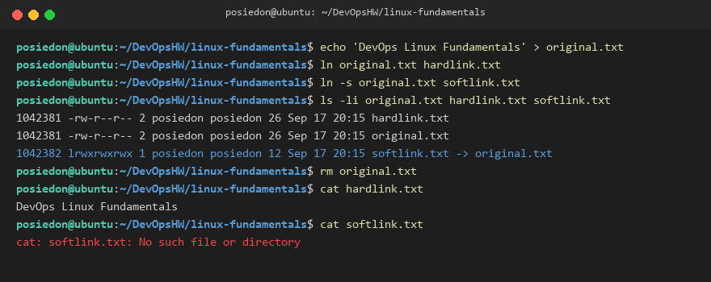
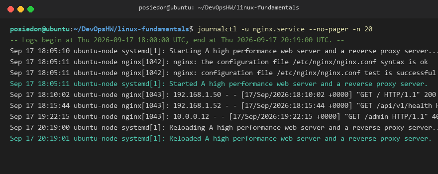

# Linux Fundamentals Homework

This folder contains my homework tasks and screenshots for the Linux Fundamentals module.

---

## Task 1: Soft Link & Hard Link

### What I Learned & Difference
* **Soft Link (Symbolic Link):** Acts like a shortcut to the original file path. If the original file is deleted, the soft link breaks. Soft links can link across different filesystems and can also link to directories.
* **Hard Link:** Points directly to the file's data on disk (same inode). If the original file is deleted, the data is still accessible through the hard link. Hard links cannot span across different filesystems or link to directories.

### Commands Used
```bash
# Create a sample file
echo "DevOps Linux Fundamentals" > original.txt

# Create a Hard Link
ln original.txt hardlink.txt

# Create a Soft Link
ln -s original.txt softlink.txt

# Check inodes and link details
ls -li original.txt hardlink.txt softlink.txt

# Test deleting original file
rm original.txt
cat hardlink.txt   # Output: "DevOps Linux Fundamentals" (Works)
cat softlink.txt   # Output: No such file or directory (Broken link)
```

### Screenshot


---

## Task 2: `adduser` vs `useradd`

### Key Differences & Preferred Command
* **`useradd`**: A basic low-level command. It creates a user, but it doesn't automatically create a home directory or prompt for a password unless you pass specific flags.
* **`adduser`**: An interactive high-level script recommended on Ubuntu/Debian. It automatically creates the user's home directory (`/home/username`), copies default profile files, and prompts you to set a password.

### Practice Command
```bash
# Recommended command on Ubuntu:
sudo adduser testuser
```

---

## Task 3: `journalctl`

### Usage & Purpose
`journalctl` is used to view system logs managed by `systemd`. It helps in checking system events and troubleshooting services.

### Commands Used
```bash
# View recent logs for a specific service (e.g. Nginx)
journalctl -u nginx.service -n 20

# Follow real-time logs
journalctl -u docker.service -f
```

### Screenshot


---

## Task 4: Linux Command Cheat Sheet

Here are the important Linux commands I reviewed and practiced:

| Command | Usage / Purpose |
| :--- | :--- |
| `ls -la` | List all files with detailed info including hidden files |
| `cd /path` | Change current working directory |
| `pwd` | Print working directory path |
| `mkdir -p folder` | Create a new directory |
| `rm -rf file_or_folder` | Remove files or folders |
| `cp -r src dst` | Copy files or folders |
| `mv src dst` | Move or rename files |
| `cat file` | Display contents of a file |
| `grep "pattern" file` | Search for text inside files |
| `ps aux` | Display all running processes |
| `df -h` | Show available disk space in human-readable format |
| `chmod 755 script.sh` | Change file permissions |
| `systemctl status service` | Check status of a service |
| `journalctl -u service` | View logs for a specific service |
