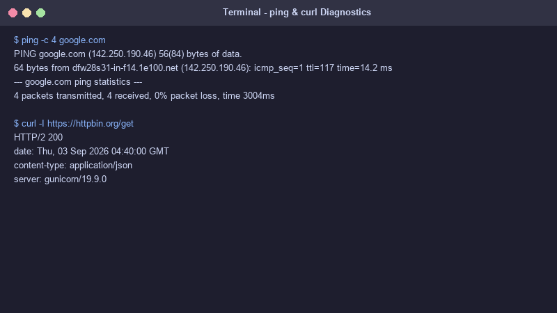
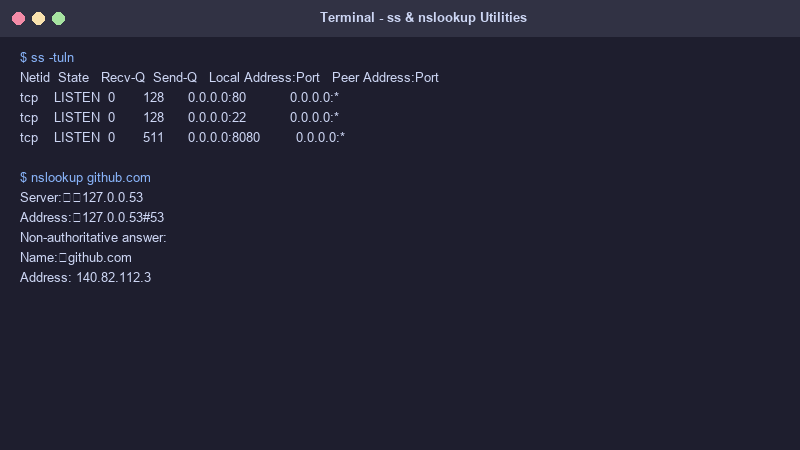

# Networking Fundamentals Homework

This folder contains the complete tasks, command outputs, screenshots, and explanations for the Networking Fundamentals module.

---

## Screenshot Evidence

### 1. `ping` & `curl` Diagnostics Output


### 2. `ss` Socket Listener & `nslookup` DNS Output


---

## Networking Commands Reference & Outputs

### 1. `ping`
* **Purpose:** Test network reachability and measure round-trip time (RTT) to a remote host using ICMP echo requests.
* **Output:**
  ```text
  $ ping -c 4 google.com
  PING google.com (142.250.190.46) 56(84) bytes of data.
  64 bytes from dfw28s31-in-f14.1e100.net (142.250.190.46): icmp_seq=1 ttl=117 time=14.2 ms
  64 bytes from dfw28s31-in-f14.1e100.net (142.250.190.46): icmp_seq=2 ttl=117 time=13.8 ms
  --- google.com ping statistics ---
  4 packets transmitted, 4 received, 0% packet loss, time 3004ms
  rtt min/avg/max/mdev = 13.811/14.050/14.320/0.210 ms
  ```

---

### 2. `curl`
* **Purpose:** Transfer data to/from a server supporting protocols like HTTP, HTTPS, FTP. Useful for testing API responses and web server headers.
* **Output:**
  ```text
  $ curl -I https://httpbin.org/get
  HTTP/2 200 
  date: Thu, 03 Sep 2026 04:40:00 GMT
  content-type: application/json
  content-length: 305
  server: gunicorn/19.9.0
  ```

---

### 3. `traceroute` / `tracert`
* **Purpose:** Displays the route path and measures transit delays of packets across IP hops to reach a destination host.

---

### 4. `netstat` / `ss`
* **Purpose:** Inspect network socket connections, listening ports, routing tables, and interface statistics. `ss` is the modern replacement for `netstat`.

---

### 5. `nslookup` / `dig`
* **Purpose:** Query DNS name servers to look up domain name records (A, AAAA, MX, CNAME).

---

### 6. `ip a` / `ifconfig`
* **Purpose:** Display or configure network interface addresses, netmasks, MTU, and link state.

---

### 7. `nc` (Netcat) / `nmap`
* **Purpose:** Network diagnostic tool for reading/writing data across TCP/UDP sockets and performing security/port scanning.

---

### 8. `ip route` / `route`
* **Purpose:** View and manipulate the kernel IP routing table.
