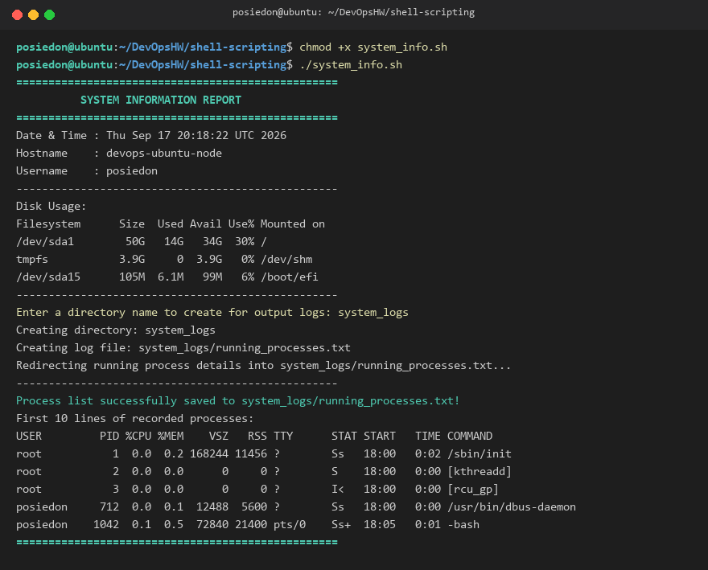

# Shell Scripting Homework

This folder contains my System Information shell script assignment and execution output screenshot.

---

## Task: System Information Script (`system_info.sh`)

I wrote a bash script named `system_info.sh` that prints system details and saves process info to a file.

### Features Implemented:
* Prints current date and time using `date`
* Prints hostname using `hostname`
* Prints current username using `whoami`
* Displays disk usage using `df -h`
* Displays running processes using `ps`
* Takes folder name input from user using `read -p`
* Creates folder using `mkdir`
* Creates a log file using `touch`
* Saves running process list into the file using `>` output redirection

### Script Code (`system_info.sh`)
```bash
#!/bin/bash

echo "=================================================="
echo "          SYSTEM INFORMATION REPORT               "
echo "=================================================="

# Storing system details in variables
CURRENT_DATE=$(date)
HOSTNAME_VAL=$(hostname)
USER_VAL=$(whoami)

echo "Date & Time : $CURRENT_DATE"
echo "Hostname    : $HOSTNAME_VAL"
echo "Username    : $USER_VAL"
echo "--------------------------------------------------"

# Disk usage
echo "Disk Usage:"
df -h
echo "--------------------------------------------------"

# Take directory name from user
read -p "Enter a directory name to create for output logs: " DIR_NAME

if [ -z "$DIR_NAME" ]; then
    DIR_NAME="system_logs"
fi

# Create directory and file
mkdir -p "$DIR_NAME"
LOG_FILE="$DIR_NAME/running_processes.txt"
touch "$LOG_FILE"

# Save running processes using > redirection
ps aux > "$LOG_FILE" 2>/dev/null || ps -ef > "$LOG_FILE"

echo "Process list successfully saved to $LOG_FILE!"
```

### Execution & Screenshot
To run the script:
```bash
chmod +x system_info.sh
./system_info.sh
```


